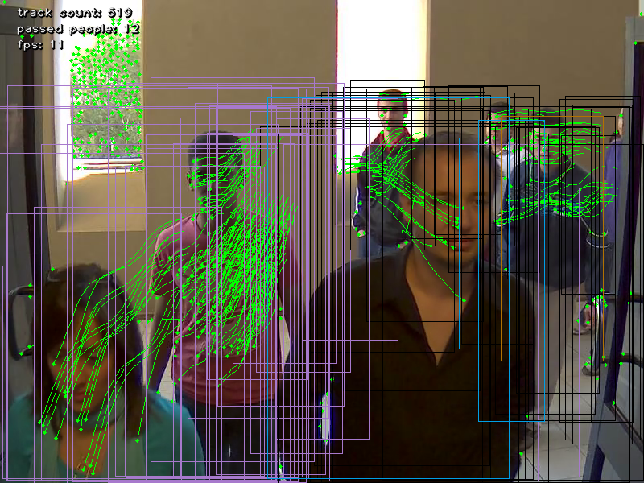

Updated people counter to work with python3. Also added the default model to the repo.

People counter
==============

Count people passing in videos. This demo uses OpenCV deep neural networks module together with optical flow to track people in images. Find more in the [technical report](https://1drv.ms/b/s!Asq_3FI_n-vzjBEKaKWhpGi50TzJ).



Dependencies
------------

The main dependency of the project is OpenCV. You need a recent version of OpenCV, at least 3.4.0 or latest master. OpenCV needs to be compiled with dnn module (enabled by default) since that is what we use for running neural network.

The project has been tested with `opencv-python` package version 3.4.0.12 and later available from PyPi via pip at https://pypi.python.org/pypi/opencv-python It should be enough to run

```
sudo pip3 install opencv-python
```

Another dependency is numpy, but that is required anyway for OpenCV bindings.

The project supports only Python 3.

Running
-------

The main script is `people_counter.py` the synopsis is:

```
usage: people_counter.py [-h] [--video VIDEO] [--proto PROTO] [--model MODEL]
                         [--confidence CONFIDENCE]
                         [--min_tracks_for_match MIN_TRACKS_FOR_MATCH]
                         [--min_track_length MIN_TRACK_LENGTH]
                         [--detect_interval DETECT_INTERVAL]

Counting people in videos

optional arguments:
  -h, --help            show this help message and exit
  --video VIDEO         path to video file. If empty, camera's stream will be
                        used
  --proto PROTO         Path to text network file:
                        MobileNetSSD_deploy.prototxt
  --model MODEL         Path to weights: MobileNetSSD_deploy.caffemodel
  --confidence CONFIDENCE
                        confidence threshold to filter out weak detections
  --min_tracks_for_match MIN_TRACKS_FOR_MATCH
                        minimum number of points that must match between
                        detection to be considered one track
  --min_track_length MIN_TRACK_LENGTH
                        minimum number of detections in one track to count one
                        person
  --detect_interval DETECT_INTERVAL
                        each detect_interval frames people detection and
                        corner detection runs. In between people are tracked
                        only using Lucas-Kanade method.
```

`--proto` and `--model` parameters must be provided and point to required files for neural network. The default values are `data/MobileNetSSD_deploy.prototxt` and `data/MobileNetSSD_deploy.caffemodel` respectively, which might be fine if you are going to use a provided data folder (see below). If not these files can be downloaded at https://github.com/chuanqi305/MobileNet-SSD.

`--video` is video file to analyse. If not provided it will try to use the first attached camera (usually a webcam).

Other parameters are optional, they are explained thoroughly in the paper.

Datasets
--------

`data` folder with video used for experiments and required files for neural network is available at https://1drv.ms/u/s!Asq_3FI_n-vzjA-1AtArIz9rct0y

Extract the `data` folder from the archive alongside `people_counter.py` and you should be able to run examples below. Visualisation should start automatically.

The examples expects a unix system with `/` as directory separator, adjust it accordingly on non-unix systems. You might also need to specify `--proto` and `--model` parameters explicitly (default values expect data folder and `/` separator).

```
./people_counter.py --video data/P1E_S1_C1.mkv
./people_counter.py --video data/P1L_S3_C2.mkv
./people_counter.py --video data/P2E_S2_C2.2.mkv
./people_counter.py --video data/P2E_S5_C2.1.mkv
```

```
./people_counter.py --video data/mv2_001.mkv --detect_interval=15
./people_counter.py --video data/Venice-1.mp4 --detect_interval=15
```

```
./people_counter.py --video data/TUD-Campus.mp4 --detect_interval=2
./people_counter.py --video data/TUD-Crossing.mp4 --detect_interval=2
```

When video stream ends the script outputs total people passed in video to stdout.
